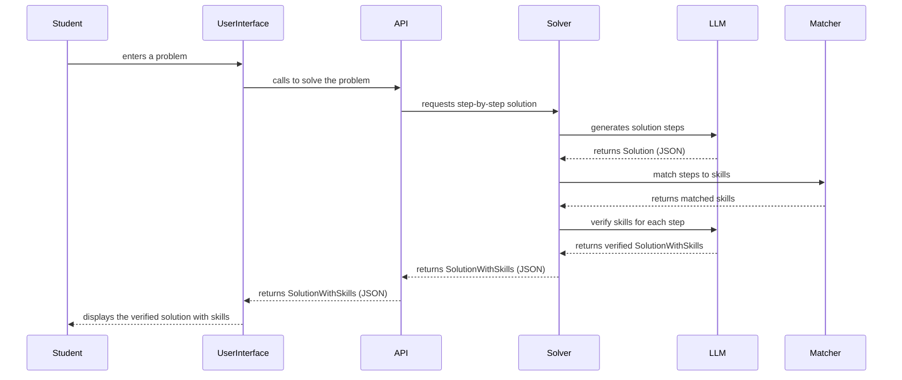

# File overview
This file presents the architecture and design of the mvp(v1) of the app. Created
to organize the idea, find the gaps.


# Components
- API
- Knowledge Graph (Neo4j)
- SQL Database
- Solver (OpenAI api service)
- Matcher (This component is responsible for matching the nodes from KG to solutions)


# Data architecture

## SQL database

### Users
#todo


## Knowledge Graph

### Curriculum
The curriculum is divided into levels 

(elementary 1-3 `1-3`, elementary 4-6 `4-6`, high-school basic `hsb` and high-school advanced `hsa`)

At each level, the requirements are organized into chapters.
Each chapter has a set of requirements.

`Chapter -- HAS_REQUIREMENT --> Requirement`

Chapters and requirements are distinguishable via
- elementID (neo4j key)
- number `number`
- name/description `name`

Chapters and requirements also have the following node properties
- level 


Each requirement is connected with even more granular concept, called a `Skill`
Skills are not part of the curriculum, but are the interpretation of the curriculum proposed by
a publishing house.

`Requirement -- INVOLVES --> Skill`

Skills are distingushable via
- name

Skills have the following node properties
- elementID (Neo4j key)
- text (a quick description)
- grade (skills are proposed independently for each grade within the level)
- type (basic or advanced)


# Repo Structure
```yaml
- backend
    - main.py # fastAPI server
    - api
        - v1
            - 
    - core
    - db #database drivers
        - neo4j.py # neo4j driver
        - base.py # base SQL database driver
    - services
        - llm.py
        - solver.py # math problem solver
        - matcher.py # 
    - models
        - schemas # api schemas
        - domain # domain models for databases
```


## Solution

### Solution
Solution is a json structured as follows
```json

{
    "steps": [ 
        {
            "step_number": 1,
            "hint": "A hint that helps without giving away the full solution",
            "solution": "The complete solution for this step"
        },
        {
            "step_number": 2,
            "hint": "...",
            "solution": "..."
        }
    ]
}
```
#todo: optional - think of extending the json with skills needed to solve the step


### SolutionWithSkills
```json

{
    "steps": [ 
        {
            "step_number": 1,
            "hint": "A hint that helps without giving away the full solution",
            "solution": "The complete solution for this step",
            "skills": [
                "neo4jid1", "neo4jid2"
            ]
        },
        {
            "step_number": 2,
            "hint": "...",
            "solution": "...",
            "skills": ["..."]
        }
    ]
}
```


## Process flow

Actors: Student, Solver, LLM, Matcher, API, UserInterface (cmd for now)
- Student enters a problem to the UserInterface
- userInterface calls api to solve the problem 
- api calls Solver to generate step-by-step solution
- solver calls LLM to generate step by step solution
- LLM returns the json Solution
- Solver asks Matcher to match the solution steps to the skills
- Matches returns matched skills *(the method not yet determined)
- solver extends the Solution with skills
- solver asks LLM to verify the skills
- LLM returns the verified solution to the solver
- solver returns `SolutionWithSkills` json to the api
- api returns the json to the UserInterface
 



## Matching the solution steps to the skills
This is the biggest challenge. One working solution, developed and tested in prototype1, was to query the graph for all the requirements first, and then to create the prompt with the requirements, and then LLM when solves the problem, has to also incliude the most relevant requirements to the solution steps. 

next, the graph is quieried to retreive all the skills connected to the requirements chosen by the LLM in the first phase, and then the second LLM message is formulated, with two mappings: step --> requirements and requirement --> skills. This way the LLM can find the skills from the KG that are needed to solve the solution step.


### Proposed solutions

#### Embeddings + RAG
0. Create skill embeddings

1. LLM solves the problem step-by-step.
    - hint
    - solution
    - skills (`instruction: "list the skills needed to solve the step"`)

1. Matcher:
    - for each skill, having the solution-step context, matches top `k` similar skills from the base (filter by a grade, maybe add the weights - the more recent grade the better - experiment later)
    - return the dict for the whole solution:
        ```json
        {
            1: {
                "hint": "...",
                "solution": "...",
                "skills":[
                    "skill_desc": "...",
                    "retreived_skills":[
                        "neo4jid": "skill_desc",
                        "neo4jid":"skill_desc",
                        ...                       
                    ]
                ]  
            },
            2: ...

        }
        ```
1. LLM
    - prompted with the augmented data (solution), choses these skills that are really relevant, ensuring the correctness of the skills.